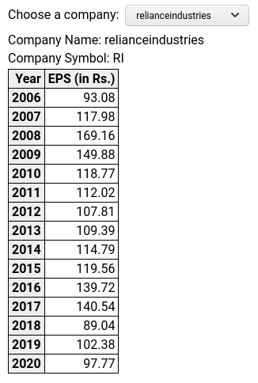

# Lambda Example

## What does it do?

Given a Stock Company Name and Symbol, this project will:
1. Download webpages for past 15 years financials data from [moneycontrol](https://www.moneycontrol.com/financials/itc/consolidated-ratiosVI/ITC).
2. Put webpages to S3.
3. Send a kinesis event of new webpage download.
4. React to new webpage download event.
5. Parse [EPS](https://en.wikipedia.org/wiki/Earnings_per_share) data.
6. Store EPS data in dynamodb.

This also provides:
1. A graphql server to query dynamodb data.
2. A React app to show EPS data for any company. See [screenshot](#react-app-screenshot).

See [Diagram](#diagram)

This project uses [localstack](https://github.com/localstack/localstack) to run AWS stuff.

## Run on Local(stack)

```bash
make run
```

## Test

```bash
aws --endpoint-url=http://localhost:4566 lambda invoke --function-name scraper --payload '{
        "company": {
                "name": "relianceindustries",
                "symbol": "RI"
        }
}' /dev/stdout
```

### Check webpage uploaded on s3

```bash
aws --endpoint-url=http://localhost:4566 s3 cp s3://webpages/relianceindustries/RI/1 /dev/stdout
```

### Check kinesis records

```bash
# Get shard iterator
aws --endpoint-url=http://localhost:4566 kinesis get-shard-iterator --shard-id shardId-000000000000 --shard-iterator-type TRIM_HORIZON --stream-name webpages-upload-stream
# Get records
aws --endpoint-url=http://localhost:4566 kinesis get-records --shard-iterator "<shard-iterator-from-above-command-output>"
```

### Check DynamoDB records

```bash
aws --endpoint-url=http://localhost:4566 dynamodb scan --table-name companies
aws --endpoint-url=http://localhost:4566 dynamodb scan --table-name financials
```

### Query DynamoDB records using graphql

```bash
# Query companies
curl 'http://localhost:4000/' \
	-H 'Content-Type: application/json' \
	-H 'Accept: application/json' \
	--data-binary '{"query":"query {\n  companies {\n    symbol\n    name\n  }\n}"}'
```

```bash
# Query financials for a symbol
curl 'http://localhost:4000/' \
	-H 'Content-Type: application/json' \
	-H 'Accept: application/json' \
	-H 'Origin: http://localhost:4000' \
	--data-binary '{"query":"query {\n  companyFinancials(symbol: \"RI\") {\n    company{\n      name\n      symbol\n    }\n    financials {\n      year\n      eps\n    }\n  }\n}"}'
```

### Use react app

Go to `https://localhost:3000`

#### <a name="react-app-screenshot"></a>Screenshot




## Stop Local(stack)

```bash
make stop
```

## <a name="diagram"></a>Diagram

```
                 ┌────────────────┐        (----------------)
 API Call ──────>│ scraper lamda  │<──────( moneycontrol.com )
                 └────────────────┘        (----------------)
                         |
                       event
                         |
                         V
                 ┌~~~~~~~~~~~~~~~~┐
                 │ kinesis stream │
                 └~~~~~~~~~~~~~~~~┘
                         |
                       event
                         |
                         V
                 ┌────────────────┐
                 │   eps lambda   │
                 └────────────────┘
                         |
                      eps data
                         |
                         V
                  /──────────────\ 
                 [    dynamodb    ]
                  \──────────────/
                         ^
                         |
                 ╒════════════════╕
                 │ graphql server │
                 ╘════════════════╛
                         ^
                         |
                 +----------------+
                 |   react app    |
                 +----------------+
```

